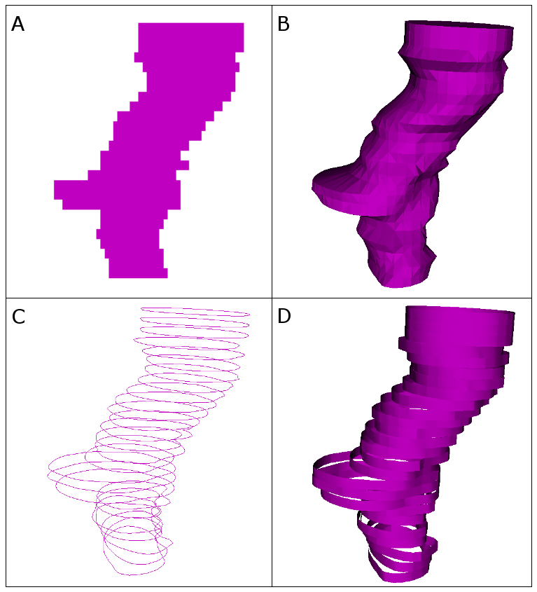
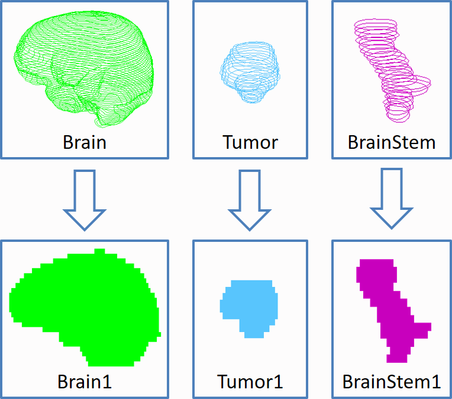
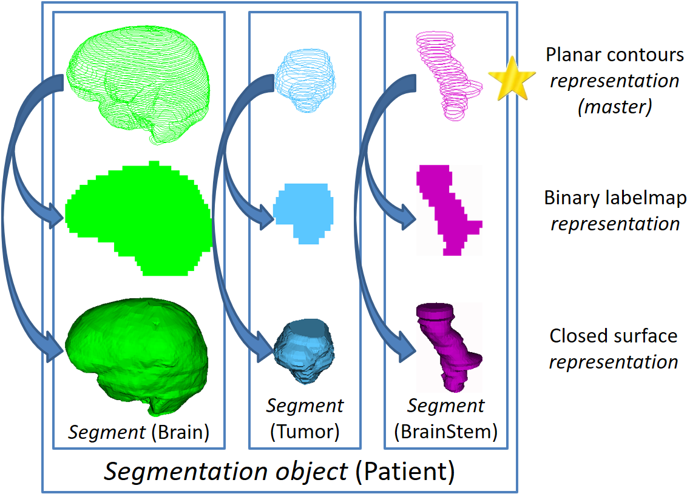
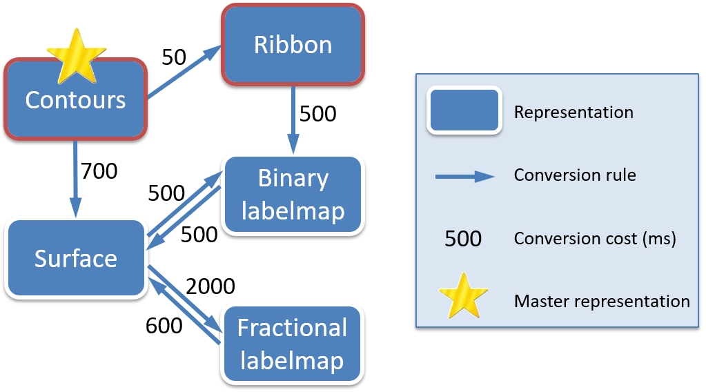
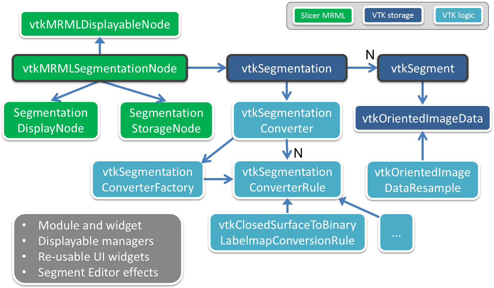

# PolySeg: Library for polymorph segmentation representation for medical image computing

Various data structures are available to represent segmentation results. Unfortunately none of them are optimal for storage, analysis, and real-time visualization at the same time, so a trade-off is typically made to choose one that is most suitable for the main purpose of the application.

There are challenges involved in the design and implementation of storage and analysis of anatomical structures that must be addressed in all software applications:
* Conversion method selection: The need for conversion is needs to be recognized, and the optimal conversion method determined
* Provenance: Relationships between converted objects need to be preserved to be able to determine their origin and identity (see figure below)
* Consistency: When a representation changes, the others become invalid, and the data scene inconsistent. Must ensure no invalid data is accessible at any time
* Coherence: Structure sets typically correspond to the same entity (i.e., a patient), so when objects are stored in memory or disk, processed, or visualized it should be possible to manage them as a unified whole

## Design of the segmentation object

A _segmentation object_ contains multiple structures and representations in one object. Each structure in a segmentation object is a _segment_, which can contain multiple representations. Segments contain their basic properties such as name and color, as well as a dictionary for storing any additional metadata.

The automatic conversion between the different segment representations is driven by a conversion graph. The nodes of the graph are the representations, and the directed edges are conversion algorithms; a typical graph is shown below.

A simplified architecture diagram of PolySeg integrated within the [3D Slicer](www.slicer.org) open-source medical image analysis and visualization platform:

